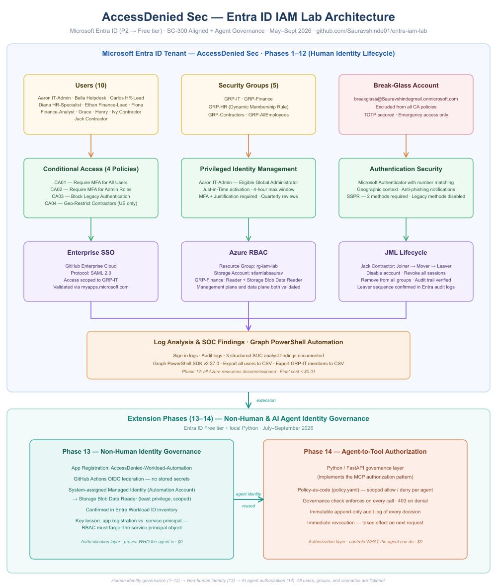

# Entra ID IAM Lab — AccessDenied Sec

A hands-on Microsoft Entra ID lab simulating enterprise Identity and Access Management (IAM) operations for a fictional company called **AccessDenied Sec**. Built to demonstrate SC-300 domain competencies to potential employers.

> **Certification:** Microsoft SC-300 — Identity and Access Administrator Associate (March 2026)  
> **Tenant:** `Sauravshindegmail.onmicrosoft.com`  
> **Subscription:** Azure Pay-As-You-Go  
> **Lab Period:** May–June 2026  
> **Instagram:** [@accessdeniedsec](https://instagram.com/accessdeniedsec)

---

## Architecture Overview

---

## What This Lab Demonstrates

This project simulates the IAM responsibilities of an Identity Engineer or SOC Analyst in a real enterprise environment — from initial tenant setup through conditional access enforcement, privileged identity management, SSO integration, Azure RBAC, identity lifecycle governance, log-based security analysis, and PowerShell automation via Microsoft Graph.

All configurations are hands-on in a live Entra ID P2 tenant with real users, groups, policies, and audit evidence.

---

## Lab Phases

| # | Phase | Status |
|---|-------|--------|
| 1 | Tenant & Environment Setup | ✅ Complete |
| 2 | Users, Groups & RBAC | ✅ Complete |
| 3 | Dynamic Groups & Admin Segregation | ✅ Complete |
| 4 | Conditional Access Policies | ✅ Complete |
| 5 | Privileged Identity Management (PIM) | ✅ Complete |
| 6 | Enterprise SSO (GitHub SAML) | ✅ Complete |
| 7 | Azure RBAC & Resource Access | ✅ Complete |
| 8 | Joiner-Mover-Leaver Lifecycle | ✅ Complete |
| 9 | Log Analysis & SOC-Style Findings | ✅ Complete |
| 10 | Automation (PowerShell + Graph) | ✅ Complete |
| 11 | Documentation Polish | ✅ Complete |
| 12 | Shutdown | ⏳ Pending |

---

## Phase Highlights

### Phase 1–3 — Foundation
Built the enterprise environment from scratch: tenant configuration, fictional company structure (AccessDenied Sec), user personas across Finance, IT, HR, and Helpdesk departments, dynamic security groups with membership rules, and admin role segregation.

### Phase 4 — Conditional Access
Disabled Security Defaults and implemented four enforced CA policies:
- **CA01** — Require MFA for all users
- **CA02** — Require MFA for admin roles
- **CA03** — Block legacy authentication
- **CA04** — Geo-restrict contractor accounts to U.S. only

Configured a break-glass account excluded via dedicated exclusion group, following Microsoft's emergency access best practices.

### Phase 5 — Privileged Identity Management (PIM)
Converted Global Administrator to an eligible Just-in-Time (JIT) role for Aaron IT-Admin — requiring Azure MFA, justification, and manager approval for activation (4-hour max window). Configured quarterly access reviews and demonstrated Eligible role assignment for Azure Storage Blob Data Reader.

### Phase 6 — Enterprise SSO
Configured SAML-based Single Sign-On for GitHub Enterprise Cloud. Assigned access via GRP-IT group. Validated app visibility differences between IT and Finance users — demonstrating group-based application access control.

### Phase 7 — Azure RBAC
Created resource group `rg-iam-lab`, storage account `stiamlabsaurav`, and blob container `iam-lab-data`. Assigned GRP-Finance both Reader (management plane) and Storage Blob Data Reader (data plane). Validated access with Fiona (Finance, granted) and Diana (HR, denied). Resolved the Entra Global Admin ≠ Azure RBAC access prerequisite issue.

### Phase 8 — Joiner-Mover-Leaver Lifecycle
Simulated a complete identity lifecycle using Jack Contractor as the subject:
- **Joiner:** Onboarded with appropriate department, title, and group (GRP-Contractors)
- **Mover:** Transitioned to IT Support Specialist — profile updated, removed from GRP-Contractors, added to GRP-IT, verified automatic GitHub SSO access inheritance
- **Leaver:** Account disabled, all sessions revoked, removed from all groups — full audit trail confirmed

### Phase 9 — Log Analysis & SOC-Style Findings
Reviewed sign-in and audit logs across the last 7 days and produced three structured SOC analyst findings:
- **Finding 1 (Medium):** MFA registration gap for Fiona Finance-Analyst — CA01 intercepted sign-in, user completed registration within 11 minutes, access restored
- **Finding 2 (Informational):** Ethan Finance-Lead authenticated successfully via My Apps portal — all four CA policies evaluated correctly
- **Finding 3 (Informational):** Jack Contractor leaver sequence confirmed in audit logs — account disable, session token invalidation, and group removal all recorded with timestamps

### Phase 10 — Automation (PowerShell + Microsoft Graph)
Connected to the Entra ID tenant via Microsoft Graph PowerShell SDK v2.37.0 and built two automation scripts:
- **Script 1:** Export all tenant users with IAM attributes to CSV (13 users — confirmed Jack's disabled account)
- **Script 2:** Export GRP-IT members to CSV (2 members — confirmed Jack's absence post-offboarding)

---

## Repository Structure
entra-iam-lab/
├── README.md
├── docs/
│   ├── 00-project-plan-tracker.md
│   ├── 01-tenant-setup.md
│   ├── 02-users-plan.md
│   ├── 03-authentication-security.md
│   ├── 04-break-glass-account.md
│   ├── 05-conditional-access-policies.md
│   ├── 06-pim-privileged-identity-management.md
│   ├── 07-enterprise-sso.md
│   ├── 08-azure-rbac.md
│   ├── 09-jml-lifecycle.md
│   ├── 10-log-analysis.md
│   ├── 11-automation-scripts.md
│   └── architecture-diagram.png
├── scripts/
│   ├── 01-export-users.ps1
│   └── 02-export-grp-it-members.ps1
└── screenshots/
├── 04-conditional-access/
├── 05-pim/
├── 06-enterprise-sso/
├── 07-azure-rbac/
├── 08-jml-lifecycle/
├── 09-log-analysis/
└── 10-automation/
---

## Key Technical Concepts Demonstrated

- Microsoft Entra ID P2 tenant configuration
- Conditional Access policy design and enforcement
- Just-in-Time privileged access via PIM
- SAML 2.0 SSO integration with third-party apps
- Azure RBAC — management plane vs. data plane access
- Identity lifecycle governance (Joiner-Mover-Leaver)
- Sign-in log analysis and CA policy validation
- Audit log review and SOC-style findings documentation
- Break-glass account design and emergency access hygiene
- Microsoft Graph PowerShell automation and CSV reporting

---

## Environment

| Setting | Value |
|---------|-------|
| Tenant | Sauravshindegmail.onmicrosoft.com |
| Tenant Name | AccessDenied Sec |
| Subscription | Azure Pay-As-You-Go |
| Entra ID License | P2 (trial) |
| Admin Account | admin@Sauravshindegmail.onmicrosoft.com |
| Resource Group | rg-iam-lab |

---

*This lab is for educational and portfolio purposes. All users, groups, and scenarios are fictional.*